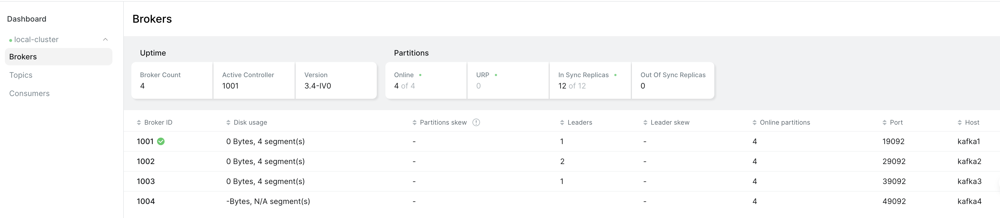
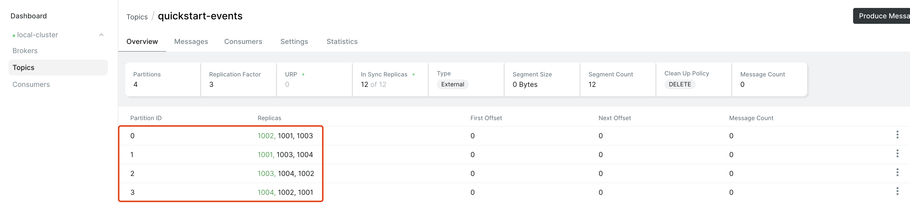
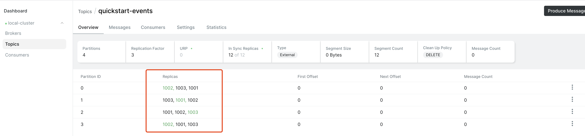

# Kafka Ops Tutorial
## 本地安装-docker
```
$ sh startLocalCluster.sh

$ docker ps | grep kafka
```

通过本地[kafka ui](http://localhost:8080/)查看集群信息。

说明：
* 该本地 kafka 集群通过 docker compose 部署，是基于 zk 的集群，节点直接通过容器网络相互访问（包括 kafka-ui），**本地要通过程序访问**，使用`localhost:19094`访问即可。

## 常用命令 & 场景问题
### 查看集群 broker 列表
#### 【推荐】方式1
通过[kafka ui](http://localhost:8080/ui/clusters/local-cluster/brokers)查看：



#### 方式 2
```bash
docker exec -it <kafka_cluster_zk_container_name> /bin/bash zkCli.sh
# example
# docker exec -it local-kafka-zookeeper-1 /bin/bash zkCli.sh

# in zkCli
ls /brokers/ids
```

### [分区副本重分配](https://doc.knowstreaming.com/study-kafka/6-operation#614-%E5%88%86%E5%8C%BA%E5%89%AF%E6%9C%AC%E9%87%8D%E5%88%86%E9%85%8D-kafka-reassign-partitions)

分区副本重分配应用场景：

1. 新增 broker 节点，需要将主题分区“均衡分配”；
2. 下线部分 broker 节点，需要将“下线节点”的主题分区重分配到指定剩余节点；

> Q1：如果某个 broker 因为某些原因永久故障下线，它所拥有的 follower 副本分区数据会重建吗，如果会具体是如何重建的？<br> A1：基于 zk 的 Kafka 不支持“自动重建”，参考链接 https://lxblog.com/qianwen/share?shareId=1a85e0ae-bfc6-47eb-bf3a-64e20b430d8c

#### 示例
> 后续所有对 broker 主题的操作默认都执行了如下命令。
```bash
$ docker run -it --rm --network kafka-ops-tutorial_default -v .:/tmp/kafka-ops-tutorial docker.io/bitnami/kafka:3.4 /bin/bash

$ cd /opt/bitnami/kafka
```

新建一个 topic，4 分区 3 副本：
```bash
bin/kafka-topics.sh --create --topic quickstart-events --bootstrap-server kafka1:19092 --partitions 4 --replication-factor 3
```
如下图所示，可以看到当前主题`quickstart-events`的分布信息。


现在假设我们有一个需求：节点`1004`需要下线，需要把对应数据转移到剩下的 broker 上，执行如下步骤操作：
1. 创建`reassignment-quickstart-events.json`文件，并添加如下内容：
```json
{
  "topics": [
    {
      "topic": "quickstart-events"
    }
  ],
  "version": 1
}
```
2. 执行如下命令：
```bash
bin/kafka-reassign-partitions.sh --bootstrap-server kafka1:19092 --topics-to-move-json-file /tmp/kafka-ops-tutorial/reassignment-quickstart-events.json --broker-list "1001,1003,1002" --generate
```
得到类似这样的输出，拷贝第二段输出到文件``中：
```plaintext
$ bin/kafka-reassign-partitions.sh --bootstrap-server kafka1:19092 --topics-to-move-json-file /tmp/kafka-ops-tutorial/reassignment-quickstart-events.json --broker-list "1001,1003,1002" --generate
Picked up JAVA_TOOL_OPTIONS: 
Current partition replica assignment
{"version":1,"partitions":[{"topic":"quickstart-events","partition":0,"replicas":[1002,1001,1003],"log_dirs":["any","any","any"]},{"topic":"quickstart-events","partition":1,"replicas":[1001,1003,1004],"log_dirs":["any","any","any"]},{"topic":"quickstart-events","partition":2,"replicas":[1003,1004,1002],"log_dirs":["any","any","any"]},{"topic":"quickstart-events","partition":3,"replicas":[1004,1002,1001],"log_dirs":["any","any","any"]}]}

Proposed partition reassignment configuration
{"version":1,"partitions":[{"topic":"quickstart-events","partition":0,"replicas":[1002,1003,1001],"log_dirs":["any","any","any"]},{"topic":"quickstart-events","partition":1,"replicas":[1003,1001,1002],"log_dirs":["any","any","any"]},{"topic":"quickstart-events","partition":2,"replicas":[1001,1002,1003],"log_dirs":["any","any","any"]},{"topic":"quickstart-events","partition":3,"replicas":[1002,1001,1003],"log_dirs":["any","any","any"]}]}
```
3. 执行如下命令：
```bash
bin/kafka-reassign-partitions.sh --bootstrap-server kafka1:19092 --reassignment-json-file /tmp/kafka-ops-tutorial/reassignment-configuration.json --execute
```
4. kafka ui 查看结果：


当然，我们也可以直接通过命令查看主题的最新信息：
> 输出信息仅供参考。
```bash
$ bin/kafka-topics.sh --describe --topic quickstart-events --bootstrap-server kafka1:19092
Picked up JAVA_TOOL_OPTIONS: 
Topic: quickstart-events	TopicId: kimuAsqtSESCOG5e9Lmq5Q	PartitionCount: 4	ReplicationFactor: 3	Configs: 
	Topic: quickstart-events	Partition: 0	Leader: 1002	Replicas: 1002,1003,1001	Isr: 1002,1001,1003
	Topic: quickstart-events	Partition: 1	Leader: 1001	Replicas: 1003,1001,1002	Isr: 1001,1003,1002
	Topic: quickstart-events	Partition: 2	Leader: 1003	Replicas: 1001,1002,1003	Isr: 1003,1002,1001
	Topic: quickstart-events	Partition: 3	Leader: 1002	Replicas: 1002,1001,1003	Isr: 1002,1001,1003
```
